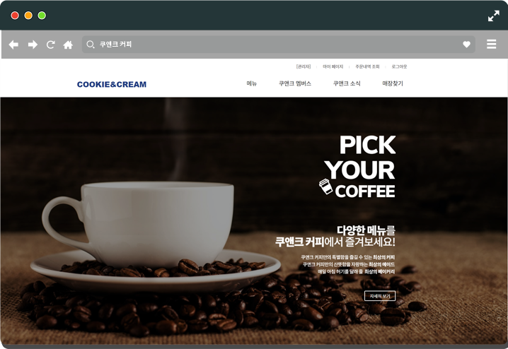
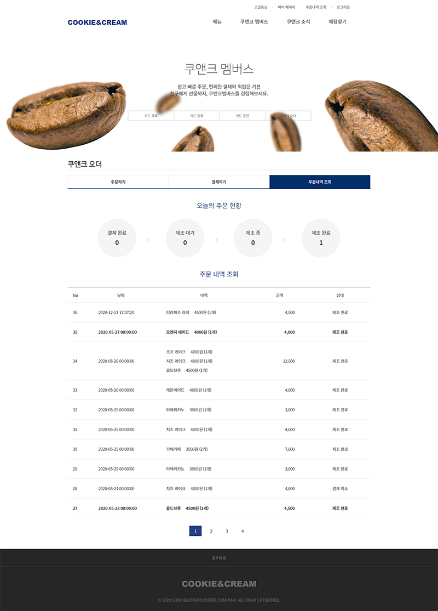
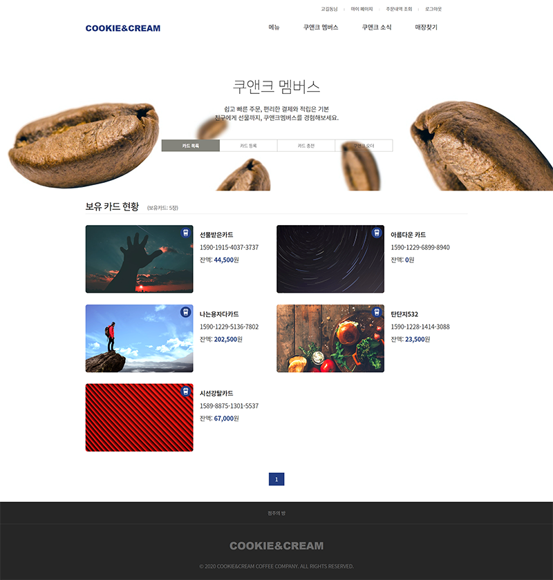
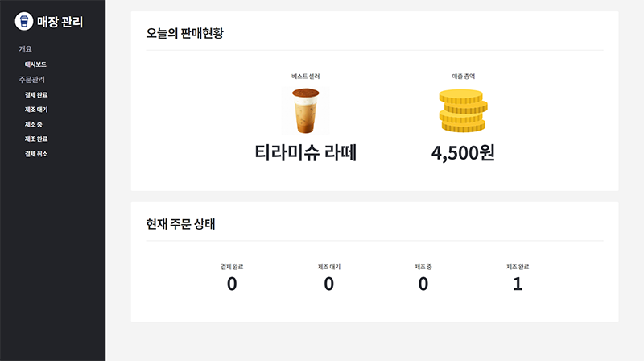

# ☕ 쿠앤크 커피

## 이디야 + 스타벅스 사이렌오더 클론하기 프로젝트

  

# 데모

[Go to the Website](http://java.sannim.com/cafe/main/index.do)

  

[PC Browser Mockup - Designed by Grapheberry](https://www.graphberry.com/item/flat-browser-mockup/)

[Mobile Mockup - Designed by Freepik](https://freepik.com)

## 참고 사이트

-   주요 홈페이지 레이아웃 등
    -   [이디야 커피](https://www.ediya.com/)
-   쿠앤크오더 메뉴 구성
    -   [스타벅스 (한국)](https://www.starbucks.co.kr/index.do)
    -   [Starbucks.com](https://www.starbucks.com/)

## 목차

1. 특징

2. 사용 기술

## 1. 특징

-   웹 표준 마크업을 지향하고자 HTML5, CSS3를 이용하여 웹 문서를 작성하였습니다.
-   Java 코드에서 자주 사용되는 변수는 인터페이스에 상수로 선언하여 참조하였습니다.
-   Ajax를 이용하여 비동기 통신을 사용하였습니다.

## 2. 사용기술

### FE

1. HTML5, CSS3, Javascript ES5 이전 문법
2. jQuery (DOM 관리, Ajax 작업 with Promise)

### BE

1. Java/Servlet
2. Oracle 18c

### Others

1. Git & Github
2. eXERD (DB 모델링)
3. Sql Developer (powered by Oracle)
4. Eclipse-IDE 4.15.0
